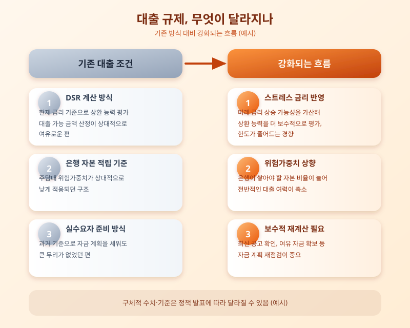

# 달라지는 대출 규제, 내 집 마련 계획에 미치는 영향

  

최근 금융당국이 가계부채 관리를 한층 강화하는 방향으로 정책을 다듬으면서, 대출을 준비하던 실수요자들의 셈법이 복잡해지고 있다. 이미 시행 중인 DSR(총부채원리금상환비율)과 LTV(주택담보대출비율) 규제에 더해, 미래의 금리 상승 가능성까지 반영하는 스트레스 금리 적용이 단계적으로 강화되는 추세이고, 은행이 주택담보대출을 내줄 때 쌓아야 하는 자본 비율 관련 기준도 조정되는 흐름이다. 결과적으로 같은 소득과 같은 담보라도 실제로 받을 수 있는 대출 한도가 예전보다 줄어드는 경우가 많아지고 있다.

이런 변화가 체감되는 이유는 단순하다. 대출 한도가 줄면 실수요자가 마련해야 하는 자기자본 비중이 커지고, 그만큼 내 집 마련 시점이나 방식에 대한 계획을 다시 짜야 하기 때문이다. 특히 수도권이나 규제지역에서 주택 구입을 고려하는 경우, 지역별로 적용되는 규제 강도가 다를 수 있다는 점도 꼭 확인해야 할 부분이다. 반대로 정부는 실수요자 보호를 위한 예외 조항이나 지원 제도도 함께 운영하고 있어, 본인이 어떤 조건에 해당하는지 꼼꼼히 따져보는 것이 무엇보다 중요하다.

  

그렇다면 지금 시점에서 무엇을 준비해야 할까. 우선 본인의 소득 대비 상환 능력을 보수적으로 계산해보고, 금리가 오르는 상황까지 가정한 여유 자금 계획을 세워두는 것이 좋다. 또한 대출 규제는 정책 방향에 따라 수시로 조정될 수 있는 만큼, 실제 대출 신청 전에는 반드시 최신 공고와 은행별 안내를 다시 확인해야 한다. 막연히 예전 기준으로 계획을 세웠다가는 예상보다 적은 한도에 당황할 수 있다.

결국 대출 규제 강화는 당장은 불편하게 느껴지더라도, 무리한 차입으로 인한 가계 리스크를 줄이려는 큰 방향성 안에서 이해할 필요가 있다. 내 집 마련을 준비하고 있다면, 규제 변화의 큰 흐름을 파악하는 동시에 본인만의 자금 계획을 촘촘히 세워 두는 것이 가장 확실한 대비책이 될 것이다.

※ 이 초안은 AI가 생성했습니다. 게시 전 수치·정책 내용의 사실관계를 반드시 확인하세요.
