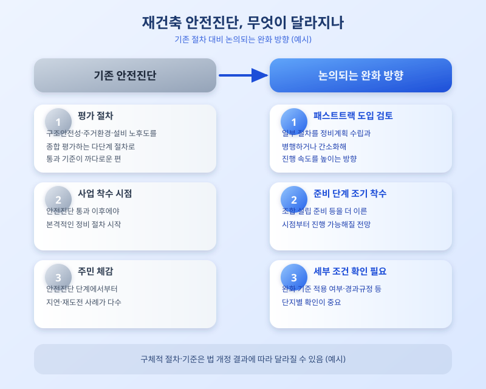

# 재건축 안전진단 완화 논의, 노후 아파트 재건축 속도 빨라지나

  

노후 아파트 재건축을 가로막아온 대표적 걸림돌로 꼽혀온 안전진단 제도를 완화하는 방안이 다시 논의 테이블에 올랐다. 정기국회에서 도시정비법 개정 논의가 이어지면서, 안전진단 통과 요건을 낮추거나 일부 단계를 건너뛰는 이른바 '패스트트랙' 도입 여부가 관심을 모으고 있다. 재건축 연한을 채운 단지들이 전국 곳곳에 쌓여 있는 만큼, 이번 논의의 향방에 따라 재건축 시장 전체의 속도가 달라질 수 있다는 전망이 나온다.

기존 안전진단은 구조안전성, 주거환경, 설비 노후도 등을 종합적으로 평가해 재건축 여부를 가리는 절차로, 통과 기준이 까다로워 사업 초기 단계에서부터 발이 묶이는 단지가 적지 않았다. 이 때문에 일부 지자체나 주민들 사이에서는 안전진단을 사실상 형식적 절차로 완화하거나, 정비계획 수립과 병행해 진행하는 방식으로 바꿔야 한다는 목소리가 꾸준히 제기돼 왔다. 이번에 논의되는 개편안 역시 이런 요구를 상당 부분 반영하는 방향으로 알려져 있다.

  

다만 안전진단 완화가 곧바로 재건축 속도로 이어질지는 지켜볼 필요가 있다. 안전진단 문턱이 낮아지더라도 조합 설립, 사업시행인가, 관리처분계획 등 뒤이은 단계마다 이해관계 조율이 필요하고, 공사비 상승과 분담금 부담 문제도 별도로 해결해야 하기 때문이다. 일각에서는 안전진단이 과도하게 완화될 경우 구조적으로 문제가 없는 단지까지 재건축 대상에 포함되면서 도시 전체의 정비 방향이 흐트러질 수 있다는 우려도 나온다.

재건축을 준비하는 단지 주민이라면, 지금 시점에서는 법 개정안의 세부 조건과 시행 시기를 꾸준히 확인하는 것이 우선이다. 완화된 기준이 우리 단지에 적용되는지, 예외 조항이나 경과 규정은 없는지 등을 관리사무소나 정비사업 조합을 통해 미리 파악해두면 향후 대응이 한결 수월해진다.

결국 안전진단 완화 논의는 노후 주택 문제를 해결하기 위한 정책적 고민의 연장선에 있지만, 제도가 실제로 어떻게 확정되고 현장에 적용될지는 아직 유동적이다. 재건축을 준비하고 있다면 이번 논의를 관심 있게 지켜보면서도, 성급한 기대보다는 정확한 정보를 바탕으로 계획을 세우는 신중함이 필요한 시점이다.

※ 이 초안은 AI가 생성했습니다. 게시 전 수치·정책 내용의 사실관계를 반드시 확인하세요.
