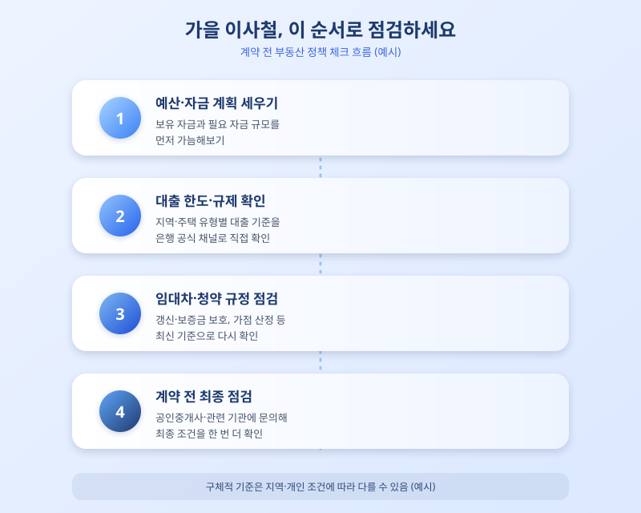

# 가을 이사철 앞두고, 지금 확인해야 할 부동산 정책 체크리스트

  

선선한 바람이 불기 시작하면 어김없이 찾아오는 것이 바로 가을 이사철입니다. 통상 9월부터 11월 사이에는 전세와 매매 거래가 동시에 늘어나면서 한 해 중 부동산 시장이 가장 분주해지는 시기이기도 합니다. 문제는 이 시기를 전후로 대출 규제나 임대차 제도, 청약 조건 같은 정책들이 조금씩 손질되는 경우가 많다는 점입니다. 예전에 알아본 내용을 그대로 믿고 움직였다가 뒤늦게 계획이 틀어지는 경우도 적지 않습니다. 본격적으로 발품을 팔기 전에 최신 정책부터 한 번 점검해보는 것이 순서입니다.

가장 먼저 살펴봐야 할 것은 주택담보대출과 관련된 규제입니다. 대출 한도, 소득 대비 상환 능력을 따지는 기준, 지역별 규제 강도는 시기마다 조금씩 달라지는 경우가 많습니다. 특히 실거주 요건이나 갭투자 관련 규제가 지역이나 주택 유형에 따라 다르게 적용될 수 있어, 계획 중인 거래가 어떤 기준을 적용받는지 은행이나 금융 공식 채널을 통해 미리 확인해두는 습관이 필요합니다.

  

전월세를 준비하는 세입자라면 임대차 관련 제도의 변화도 놓치지 말아야 합니다. 계약 갱신이나 전세보증금 반환과 관련된 보호 장치, 전세자금대출 조건 등은 실수요자의 자금 계획에 직접적인 영향을 미치기 때문입니다. 청약을 준비 중이라면 가점 산정 방식이나 특별공급 요건처럼 세부 규정이 수시로 조정될 수 있다는 점도 감안해야 합니다. '예전에 이랬다더라'는 식의 정보보다는, 계약이나 신청 직전 시점에 관련 기관 공지를 다시 확인하는 편이 안전합니다.

결국 가을 이사철을 앞두고 가장 중요한 것은 서두르지 않고 순서대로 점검하는 태도입니다. 예산 계획, 대출 가능 여부, 임대차 보호 규정, 청약 조건까지 하나씩 짚어보면서 본인 상황에 맞는 선택지를 좁혀가는 과정이 필요합니다. 정책은 지역이나 개인 조건에 따라 다르게 적용될 수 있는 만큼, 궁금한 부분은 은행이나 공인중개사, 관련 기관을 통해 직접 확인하는 것이 가장 확실한 방법입니다. 바쁜 이사철일수록 기본을 지키는 것이 결국 시간과 비용을 아끼는 지름길이 될 것입니다.

※ 이 초안은 AI가 생성했습니다. 게시 전 수치·정책 내용의 사실관계를 반드시 확인하세요.
