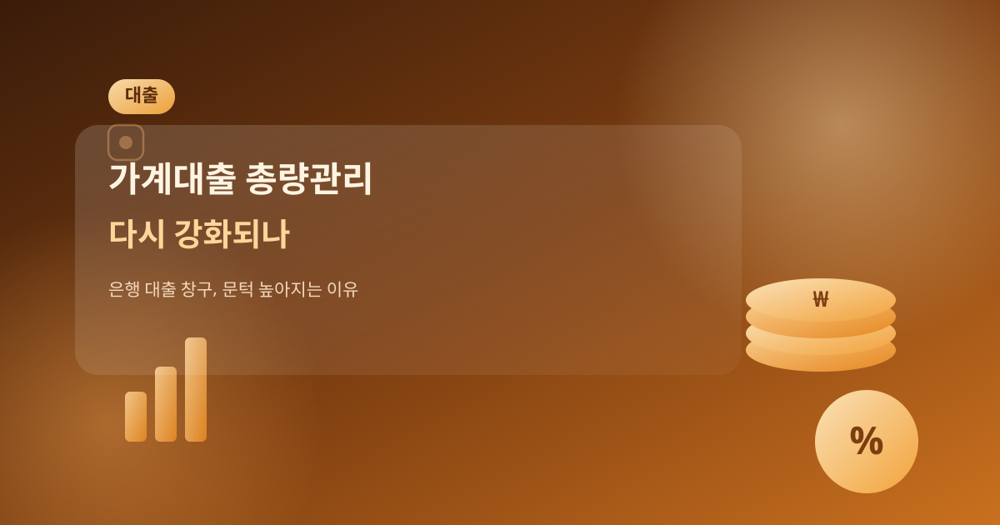
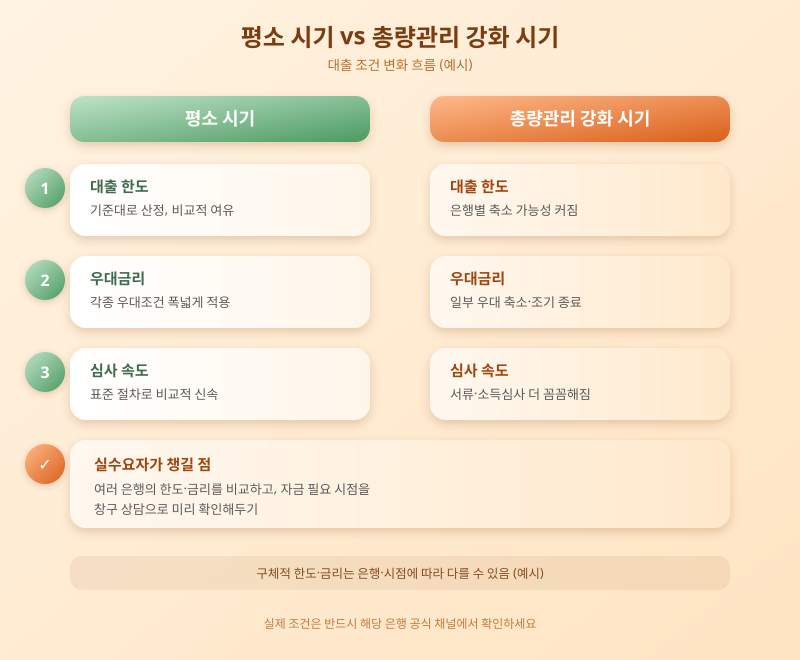

# 가계대출 총량관리 다시 강화되나, 은행 대출 창구 문턱 높아지는 이유

  

가을 이사철을 맞아 주택 자금 수요가 늘어나는 시기, 은행권에서는 가계대출 총량 관리를 다시 강화하려는 움직임이 감지되고 있습니다. 총량관리란 은행이 한 해 동안 늘릴 수 있는 가계대출 규모에 사실상 한도를 두는 방식으로, 금융당국의 가계부채 관리 기조와 맞물려 시행 강도가 시기마다 달라져 왔습니다. 최근 들어 일부 은행이 신규 대출 심사를 다시 깐깐하게 하거나 우대금리 혜택을 줄이는 움직임을 보이면서, 대출을 계획 중인 실수요자들 사이에서는 지금 받아야 할지 기다려야 할지 고민이 커지고 있습니다.

은행들이 대출 조이기에 나서는 배경에는 가계부채 증가 속도에 대한 우려가 자리하고 있습니다. 이사철과 맞물려 주택 관련 대출 수요가 한꺼번에 몰리면, 은행 입장에서는 연간 대출 증가 목표치를 넘기지 않도록 속도 조절에 나설 수밖에 없습니다. 이 과정에서 은행별로 한도 축소, 우대금리 폐지, 심사 기준 강화 등 다양한 방식이 동원되며, 같은 상품이라도 은행이나 신청 시점에 따라 실제 받을 수 있는 조건이 달라질 수 있습니다.

  

신규로 대출을 알아보는 사람이라면 몇 가지는 미리 챙겨두는 것이 좋습니다. 우선 한두 곳의 견적만 보고 결정하기보다는 여러 은행의 한도와 금리 조건을 비교해보는 것이 안전합니다. 또한 총량 관리가 강화되는 시기에는 월별로 대출 가능 여력이 달라질 수 있으므로, 자금이 필요한 시점을 은행 창구나 상담을 통해 미리 확인해두는 편이 좋습니다. 고정금리와 변동금리 중 어느 쪽이 유리할지, 중도상환수수료는 어떻게 되는지도 함께 따져봐야 나중에 후회를 줄일 수 있습니다.

결국 가계대출 총량관리는 개인이 통제할 수 있는 변수가 아니지만, 그 흐름을 미리 파악해두면 자금 계획을 세우는 데 큰 도움이 됩니다. 대출을 서두르기보다는 본인의 상환 능력과 자금 스케줄을 먼저 점검하고, 여러 금융기관의 조건을 비교하는 습관을 들이는 것이 무엇보다 중요합니다. 정책과 은행 내부 방침은 예고 없이 바뀔 수 있는 만큼, 실제 신청 전에는 반드시 해당 은행과 금융당국의 최신 공지를 확인하시기 바랍니다.

※ 이 초안은 AI가 생성했습니다. 게시 전 수치·정책 내용의 사실관계를 반드시 확인하세요.
