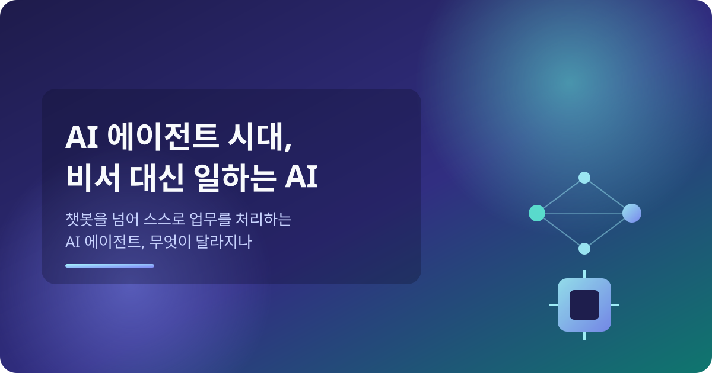
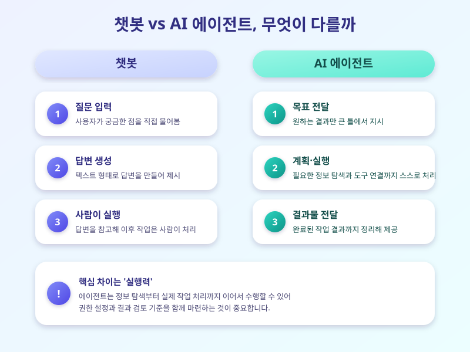

# AI 에이전트 서비스 확산, 비서 대신 업무 처리해주는 AI 시대 오나

  

최근 들어 단순히 질문에 답하는 챗봇을 넘어, 스스로 여러 단계를 계획하고 실행하는 'AI 에이전트' 서비스가 빠르게 늘고 있습니다. 이메일 정리나 일정 조율 같은 반복 업무부터 자료 조사, 보고서 초안 작성까지, 사람이 하나하나 지시하지 않아도 목표만 던져주면 중간 과정을 스스로 처리하는 방식이 특징입니다. 국내외 여러 기업이 앞다퉈 관련 서비스를 내놓으면서, 이제는 'AI에게 물어본다'는 표현보다 'AI에게 맡긴다'는 표현이 더 어울리는 시대로 접어들고 있다는 평가도 나옵니다.

기존 챗봇과 AI 에이전트의 가장 큰 차이는 '실행력'에 있습니다. 챗봇이 질문에 대한 답을 텍스트로 제시하는 데 그쳤다면, 에이전트는 필요한 정보를 스스로 찾아보고, 여러 도구나 프로그램을 연결해 실제 작업까지 이어서 처리합니다. 예를 들어 여행 일정을 짜 달라고 요청하면 항공권과 숙소 정보를 찾아보고 비교한 뒤 일정표까지 정리해주는 식입니다. 업무 현장에서는 데이터 정리, 초안 작성, 반복적인 보고서 업데이트 같은 영역에서 이러한 에이전트 활용 사례가 눈에 띄게 늘고 있습니다.

  

기대와 함께 우려의 목소리도 커지고 있습니다. 업무 효율이 크게 높아질 수 있다는 기대가 있는 반면, AI가 잘못된 정보를 근거로 판단하거나 권한 밖의 작업을 실행할 위험, 그리고 이 과정에서 다뤄지는 데이터의 보안과 개인정보 문제도 함께 제기됩니다. 특히 여러 서비스와 연동되는 구조인 만큼, 하나의 오류가 여러 시스템으로 번질 가능성도 배제할 수 없습니다.

이런 흐름 속에서 개인과 기업 모두 준비가 필요합니다. 개인이라면 반복적이고 정형화된 업무부터 AI 에이전트에 맡겨보며 활용 범위를 점차 넓혀가는 것이 안전한 접근입니다. 기업이라면 에이전트에게 어디까지 권한을 줄지, 결과물을 사람이 어떻게 검토할지에 대한 내부 기준을 먼저 마련하는 것이 중요합니다. AI 에이전트는 분명 업무 방식을 바꿀 잠재력을 가지고 있지만, 그 힘을 안전하게 쓰기 위한 준비가 함께 갖춰져야 진짜 효과를 볼 수 있을 것입니다.

※ 이 초안은 AI가 생성했습니다. 게시 전 수치·정책 내용의 사실관계를 반드시 확인하세요.
