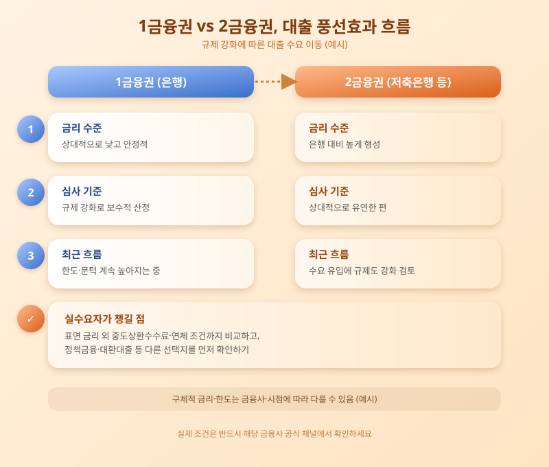

# 은행 조이자 2금융권으로, 대출 풍선효과 커지나

  

최근 은행권을 중심으로 가계대출 관리가 강화되면서, 주택담보대출이나 신용대출을 받기가 예전보다 까다로워졌다는 이야기가 많습니다. 이런 흐름 속에서 은행 문턱을 넘지 못한 대출 수요가 저축은행이나 캐피탈사 같은 이른바 '2금융권'으로 옮겨가는 조짐이 나타나고 있습니다. 한쪽을 조이면 다른 쪽으로 수요가 쏠리는 '풍선효과' 우려가 다시 고개를 드는 이유입니다.

1금융권으로 불리는 은행은 상대적으로 낮은 금리와 안정적인 조건을 제공하지만, 최근에는 총량관리와 스트레스 DSR 등 규제가 겹치면서 한도 산정이 더 보수적으로 이뤄지는 분위기입니다. 반면 저축은행이나 캐피탈, 카드사 등 2금융권은 심사 기준이 상대적으로 유연한 대신 금리가 높고, 상환 부담이 커질 수 있다는 점에서 차이가 있습니다. 은행 문턱이 높아질수록 이 차이를 잘 모르고 2금융권을 찾는 사람이 늘어날 수 있다는 우려가 나옵니다.

  

금융당국도 이러한 흐름을 예의주시하며 2금융권에 대한 건전성 관리와 대출 규제를 함께 강화하는 방향을 검토하고 있습니다. 특정 업권만 규제하면 다른 업권으로 부채가 옮겨갈 뿐이라는 판단에서, 업권 간 형평성을 맞추려는 움직임으로 볼 수 있습니다. 다만 이 과정에서 서민·취약계층이 이용하는 정책금융이나 소액 생계자금 대출까지 지나치게 위축되지 않도록 세심한 접근이 필요하다는 지적도 함께 나옵니다.

실수요자라면 당장 대출이 필요한 상황이라 하더라도 금리와 상환 조건을 여러 금융사에 걸쳐 꼼꼼히 비교해보는 것이 중요합니다. 2금융권 대출을 고려하고 있다면 표면 금리뿐 아니라 중도상환수수료나 연체 시 불이익 등 부가 조건까지 함께 따져보고, 가능하다면 정책금융상품이나 대환대출 인프라를 먼저 확인해보는 것이 안전합니다. 대출은 한 번 받으면 되돌리기 쉽지 않은 만큼, 조급하게 결정하기보다 여러 선택지를 차분히 비교하는 습관이 필요합니다.

※ 이 초안은 AI가 생성했습니다. 게시 전 수치·정책 내용의 사실관계를 반드시 확인하세요.
