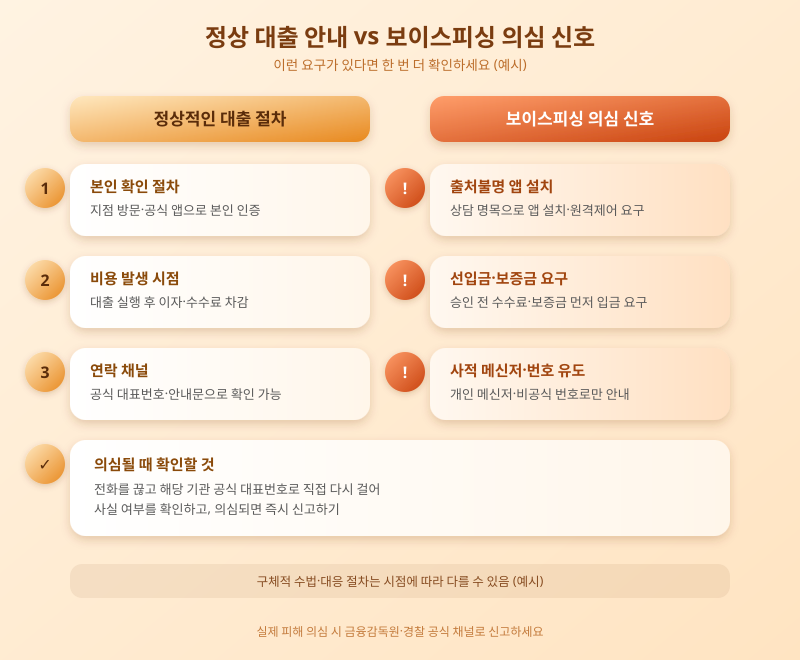

# 대출빙자형 보이스피싱 급증, 이렇게 확인하면 안전합니다

  

"저금리로 갈아탈 수 있다"거나 "정책자금 대출 대상자로 선정됐다"는 전화나 문자를 받아본 적 있으신가요? 최근 이런 식으로 접근해 개인정보나 금전을 가로채는 대출빙자형 보이스피싱 피해가 다시 늘고 있다는 이야기가 이어지고 있습니다. 은행권 대출 문턱이 높아지면서 급전이 필요한 사람들의 불안한 심리를 노린 범죄가 기승을 부리는 모습입니다.

대출빙자형 보이스피싱은 은행이나 정부 정책금융기관을 사칭해 낮은 금리, 빠른 승인을 미끼로 접근하는 방식이 대표적입니다. 상담을 빙자해 특정 애플리케이션 설치를 유도하거나, 신용등급을 올려준다며 먼저 수수료나 보증금 명목의 입금을 요구하는 경우가 많습니다. 실제 금융회사는 대출 실행 전에 먼저 돈을 보내라고 요구하지 않는다는 점에서, 이런 요구는 그 자체로 사기를 의심해볼 근거가 됩니다.

  

이런 피해가 늘어나는 배경에는 가계대출 관리가 강화되며 은행 문턱을 넘지 못한 수요가 커진 상황이 자리하고 있습니다. 대출이 급한 사람일수록 판단이 흐려지기 쉽고, 범죄 조직은 문자나 전화뿐 아니라 실제 은행 로고와 상담원 이름까지 흉내 낸 가짜 안내문, 발신번호 조작 등 점점 더 정교한 수법으로 이런 심리를 파고듭니다. 이에 금융당국과 은행권도 의심거래 모니터링과 지연인출제도 운영, 공식 채널 안내 강화, 신고 즉시 계좌 지급정지 지원 등으로 대응 수위를 높이고 있습니다.

대출 관련 연락을 받았다면 먼저 해당 기관의 공식 대표번호로 직접 전화해 사실 여부를 확인하는 습관이 중요합니다. 출처가 불분명한 앱 설치나 원격제어 프로그램 실행 요구, 선입금 요구가 있다면 일단 거래를 멈추고 금융감독원이나 경찰에 문의하는 것이 안전합니다. 급할수록 한 박자 쉬어가는 태도가 소중한 자산을 지키는 가장 확실한 방법입니다.

※ 이 초안은 AI가 생성했습니다. 게시 전 수치·정책 내용의 사실관계를 반드시 확인하세요.
