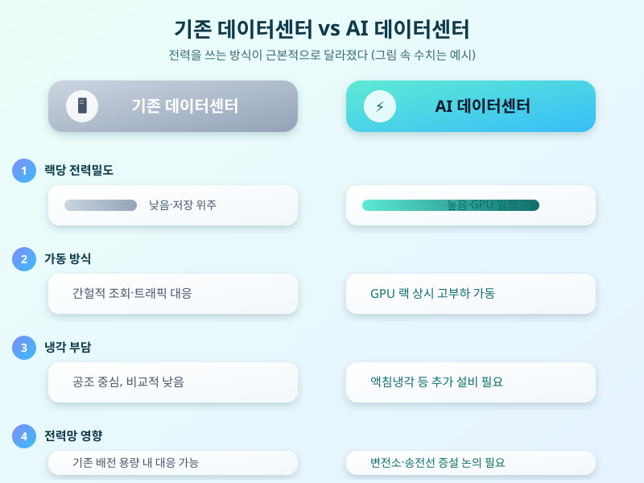

# AI 데이터센터 전력 수요 급증, 국내 전력망은 감당할 수 있을까

  

생성형 AI 서비스가 일상 곳곳에 스며들면서, 이를 뒷받침하는 데이터센터에 대한 관심도 함께 커지고 있다. 그런데 최근에는 데이터센터 그 자체보다 데이터센터가 삼키는 전력량에 대한 우려가 더 크게 다뤄지는 분위기다. AI 모델을 학습시키고 실시간으로 응답을 만들어내려면 막대한 컴퓨팅 자원이 필요한데, 이 컴퓨팅 자원을 24시간 돌리는 데 드는 전력 소비가 예상보다 훨씬 빠르게 늘고 있다는 이야기가 국내외에서 동시에 나오고 있다.

왜 이렇게 전력 소모가 커지는 걸까. 기존 데이터센터는 주로 저장·조회 위주의 서버를 돌렸지만, AI 데이터센터는 고성능 그래픽처리장치(GPU)를 랙 단위로 촘촘히 채워 넣고 이를 쉬지 않고 가동한다. 게다가 GPU가 뜨거워지지 않도록 식혀주는 냉각 설비까지 함께 돌아가야 하다 보니, 같은 면적의 건물이라도 전력밀도 자체가 예전과는 비교할 수 없이 높아졌다. 이런 특성 때문에 데이터센터 한 곳이 중소 도시급 전력을 소비하는 사례도 더는 낯설지 않게 됐다.

  

국내 상황도 예외는 아니다. 수도권과 일부 거점 지역에 데이터센터가 몰리면서 변전소·송전선 등 전력망 용량이 한계에 다다랐다는 지적이 나오고, 신규 데이터센터가 전력 공급 계약을 맺는 과정에서 지연되거나 지역 주민·지자체와 갈등을 겪는 사례도 이어지고 있다. 데이터센터 부지 선정 못지않게 전력을 어디서, 얼마나 안정적으로 끌어올 수 있는가가 사업의 성패를 가르는 조건이 되고 있는 셈이다.

이 때문에 정부와 업계는 발전·송전 인프라 확충, 데이터센터의 지방·해안 분산 배치, 액침냉각 등 에너지 효율화 기술 도입 같은 방안을 함께 검토하고 있다. 다만 발전소나 송전선 건설에는 계획부터 완공까지 오랜 시간이 걸리는 만큼, AI 서비스가 늘어나는 속도와 전력 인프라가 갖춰지는 속도 사이의 간극을 어떻게 메울지가 앞으로의 관전 포인트다. AI 경쟁력을 가르는 기준이 이제는 모델 성능뿐 아니라 전력을 안정적으로 확보했는가로 옮겨가고 있다고 봐도 무리가 아니다.

※ 이 초안은 AI가 생성했습니다. 게시 전 수치·정책 내용의 사실관계를 반드시 확인하세요.
