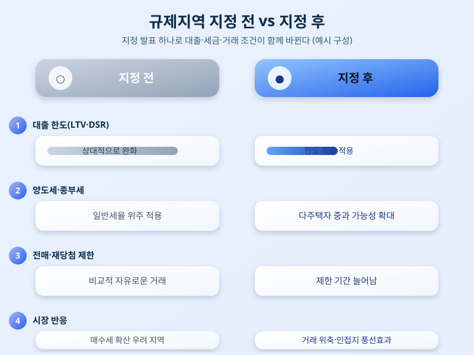

# 규제지역 추가 지정 다시 검토되나, 이번엔 어디까지 넓어질까

  

최근 수도권 일부 지역을 중심으로 아파트값 상승세가 다시 꿈틀거리면서, 정부가 규제지역 추가 지정 카드를 다시 만지작거리고 있다는 이야기가 심심찮게 들린다. 부동산 시장이 잠잠해질 만하면 꼭 등장하는 이 카드는, 지정되는 순간 대출 한도부터 세금까지 여러 조건이 한꺼번에 바뀌기 때문에 실수요자와 투자자 모두에게 파장이 크다. 이번에는 어느 지역이 새로 이름을 올릴지, 그리고 이미 규제지역으로 묶여 있던 지역들은 어떻게 될지 관심이 쏠리고 있다.

규제지역이란 투기과열지구와 조정대상지역을 아우르는 개념으로, 정부가 특정 지역의 주택 가격이나 거래량이 이상 과열됐다고 판단할 때 지정한다. 이 지역으로 묶이면 주택담보대출비율(LTV)과 총부채원리금상환비율(DSR) 같은 대출 규제가 한층 강화되고, 다주택자에 대한 양도소득세·종합부동산세 부담도 커진다. 청약 재당첨 제한이나 전매 제한 기간이 늘어나는 등 거래 자체를 까다롭게 만드는 장치도 함께 작동한다. 그만큼 한 지역이 규제지역으로 새로 지정되느냐 마느냐는 그 지역 부동산 시장의 온도를 순식간에 바꿔놓을 수 있는 변수다.

  

최근 논의가 다시 불거진 배경에는 수도권 일부 지역의 거래량과 매매가가 동시에 꿈틀거리는 흐름이 있다. 재건축·재개발 기대감이 있는 지역이나 교통 호재가 있는 지역을 중심으로 매수세가 몰리면서, 정부 입장에서는 시장이 과열 국면으로 번지기 전에 선제적으로 손을 쓰려는 움직임이 감지된다. 다만 규제지역 지정이 반드시 집값을 안정시키는 결과로 이어지는 것은 아니라는 지적도 꾸준히 나온다. 과거에도 규제가 강화된 지역에서는 거래가 잠시 얼어붙었다가, 인접한 비규제 지역으로 수요가 옮겨가는 이른바 '풍선효과'가 반복적으로 관찰됐기 때문이다.

실수요자 입장에서는 당장 살고 싶거나 매수를 고려 중인 지역이 규제지역으로 새로 지정될 가능성이 있는지 미리 살펴보는 게 중요하다. 지정 발표 이후에는 대출 한도가 갑자기 줄어들거나 잔금 계획이 꼬일 수 있는 만큼, 계약을 앞둔 상황이라면 관련 공고와 뉴스를 주기적으로 확인해두는 편이 안전하다. 규제지역 지정 여부는 결국 시장 상황에 따라 언제든 바뀔 수 있는 카드인 만큼, 단기 시세 변화에 일희일비하기보다 자신의 자금 계획과 실거주 목적에 맞춰 차분히 판단하는 자세가 필요해 보인다.

※ 이 초안은 AI가 생성했습니다. 게시 전 수치·정책 내용의 사실관계를 반드시 확인하세요.
