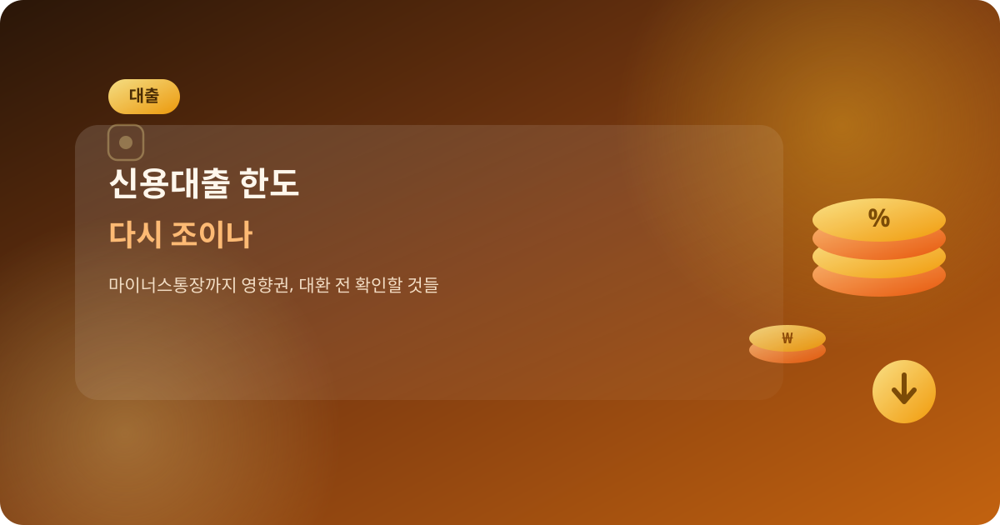
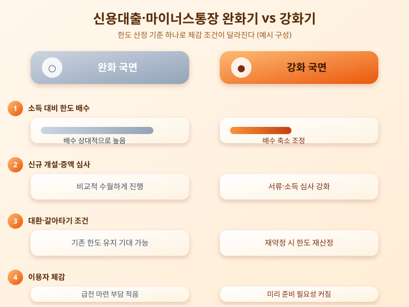

# 신용대출 한도 다시 조이나, 마이너스통장까지 영향권에 드는 이유

  

주택담보대출 문턱이 높아질 때마다 어김없이 따라붙는 이야기가 있다. 막힌 자금이 신용대출이나 마이너스통장으로 옮겨가는 이른바 풍선효과다. 최근에도 은행권을 중심으로 신용대출 심사를 다시 촘촘히 들여다보려는 움직임이 감지되면서, 급전이 필요할 때 가장 먼저 찾게 되는 마이너스통장까지 한도 조정 논의에 이름을 올리고 있다는 이야기가 나온다. 주택 관련 대출이 아니라는 이유로 상대적으로 여유 있게 보던 신용대출 영역까지 영향권에 들면서, 직장인과 자영업자 모두 이번 흐름을 눈여겨봐야 할 상황이 됐다.

신용대출과 마이너스통장 한도는 일반적으로 소득과 기존 부채 수준을 함께 반영해 산정된다. 총부채원리금상환비율(DSR) 규제가 신용대출에도 적용되기 때문에, 주담대나 다른 대출이 이미 있다면 추가로 받을 수 있는 신용대출 한도는 자연히 줄어드는 구조다. 문제는 이 한도 산정 기준이 은행마다, 또 시기마다 조금씩 다르게 움직인다는 점이다. 최근처럼 가계부채 관리 강화 기조가 이어질 때는 소득 대비 한도 배수를 낮추거나, 마이너스통장 신규 개설과 증액 심사를 더 깐깐하게 보는 방식으로 조여지는 경우가 많다.

  

기존에 마이너스통장을 쓰고 있던 사람이라면 당장 한도가 강제로 줄어드는 것은 아니지만, 만기 연장이나 재약정 시점에 조건이 달라질 수 있다는 점을 염두에 둬야 한다. 반대로 신규로 마이너스통장을 열거나 신용대출을 갈아타려는 사람은 이전보다 더 낮은 한도, 혹은 더 높은 금리 조건을 제시받을 가능성이 있다. 특히 여러 금융사에서 신용대출을 동시에 보유하고 있다면 총량 규제의 영향을 더 크게 받을 수 있어 미리 정리해두는 편이 유리하다.

결국 신용대출이든 마이너스통장이든 '언제든 한도가 다시 조정될 수 있는 상품'이라는 전제를 갖고 접근하는 자세가 필요해 보인다. 급전이 필요한 상황을 대비해 마이너스통장을 미리 열어두려 한다면 여유 있을 때 신청해두는 것이 안전하고, 이미 대출이 있는 상태에서 추가 자금이 필요하다면 한도 축소 가능성을 감안해 자금 계획을 보수적으로 짜두는 것이 좋다. 대환이나 신규 신청을 고려 중이라면 은행별 심사 기준과 한도 산정 방식을 미리 비교해보는 절차도 빼놓지 않는 게 좋겠다.

※ 이 초안은 AI가 생성했습니다. 게시 전 수치·정책 내용의 사실관계를 반드시 확인하세요.
