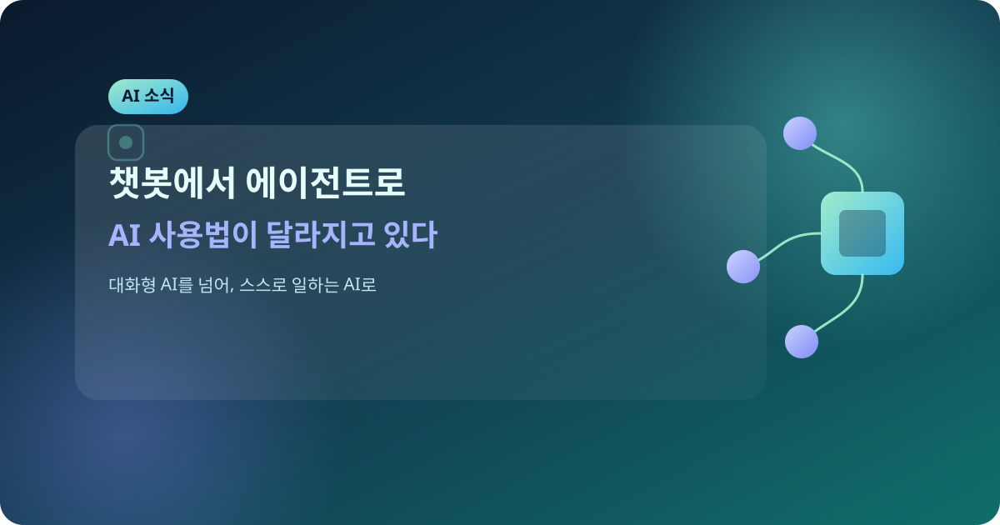
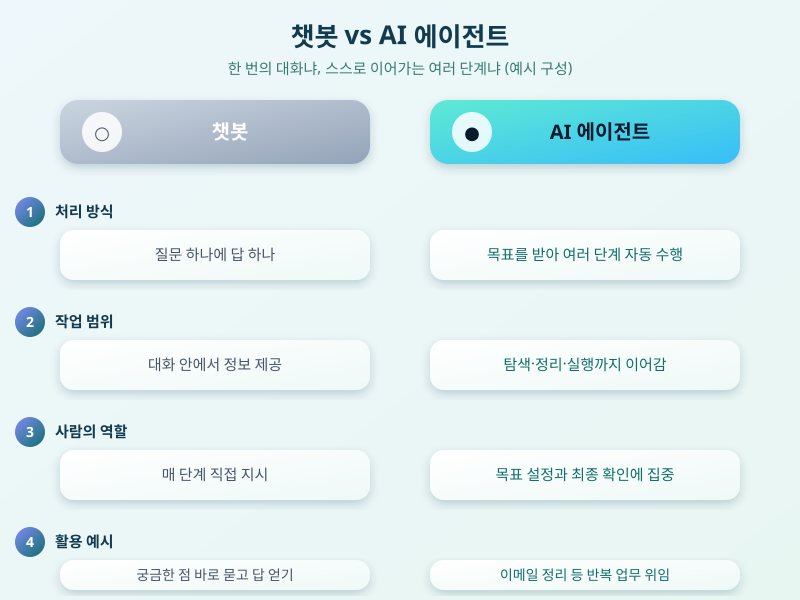

# 챗봇에서 에이전트로, AI 사용법이 달라지고 있다

  

최근 몇 년 사이 우리가 AI를 사용하는 방식이 눈에 띄게 달라지고 있다. 불과 얼마 전까지만 해도 AI라고 하면 질문을 던지고 답을 받는 '챗봇'의 형태가 익숙했다. 하지만 요즘 화제가 되는 AI 서비스들을 보면 단순히 대화를 주고받는 데서 그치지 않고, 사용자를 대신해 여러 단계의 작업을 스스로 처리하는 '에이전트' 형태로 빠르게 진화하고 있다. 이런 변화는 단순한 기술 트렌드를 넘어, 우리가 일상과 업무에서 AI를 활용하는 방식 자체를 바꾸어 놓을 가능성이 크다.

챗봇과 에이전트의 가장 큰 차이는 '한 번의 대화로 끝나는가, 아니면 여러 단계를 스스로 이어가는가'에 있다. 기존 챗봇은 질문 하나에 답 하나를 내놓는 구조였다면, 에이전트형 AI는 목표를 주면 필요한 정보를 스스로 찾아보고, 중간 결과를 판단하고, 다음 행동을 결정하는 과정을 반복한다. 예를 들어 일정 조율, 자료 정리, 반복적인 문서 작업처럼 여러 단계를 거쳐야 하는 일을 사람이 일일이 지시하지 않아도 AI가 순서대로 처리해 나가는 식이다.

  

이런 변화는 이미 실생활에서도 조금씩 체감되고 있다. 이메일을 정리하고 답장 초안을 작성하거나, 여러 자료를 취합해 요약본을 만들거나, 반복적인 업무 절차를 자동으로 수행하는 식으로 에이전트형 AI를 활용하는 사례가 늘고 있다. 다만 아직은 기술이 발전하는 과정에 있는 만큼, 결과를 무조건 신뢰하기보다는 중요한 결정이나 최종 확인 단계에서는 반드시 사람이 검토하는 습관을 들이는 것이 안전하다. 특히 AI에게 어디까지 권한을 줄 것인지, 어떤 작업까지 맡길 것인지를 스스로 명확히 정해두는 것이 중요하다.

결국 중요한 것은 새로운 기술 자체보다, 그것을 어떻게 이해하고 활용하느냐다. AI가 챗봇에서 에이전트로 진화하는 지금이야말로 각자의 일과 생활에 맞게 AI 활용법을 한 번쯤 점검해볼 좋은 시점이 아닐까 싶다. 작은 반복 업무부터 하나씩 맡겨보며 나에게 맞는 활용 방식을 찾아가는 것을 추천한다.

※ 이 초안은 AI가 생성했습니다. 게시 전 수치·정책 내용의 사실관계를 반드시 확인하세요.
