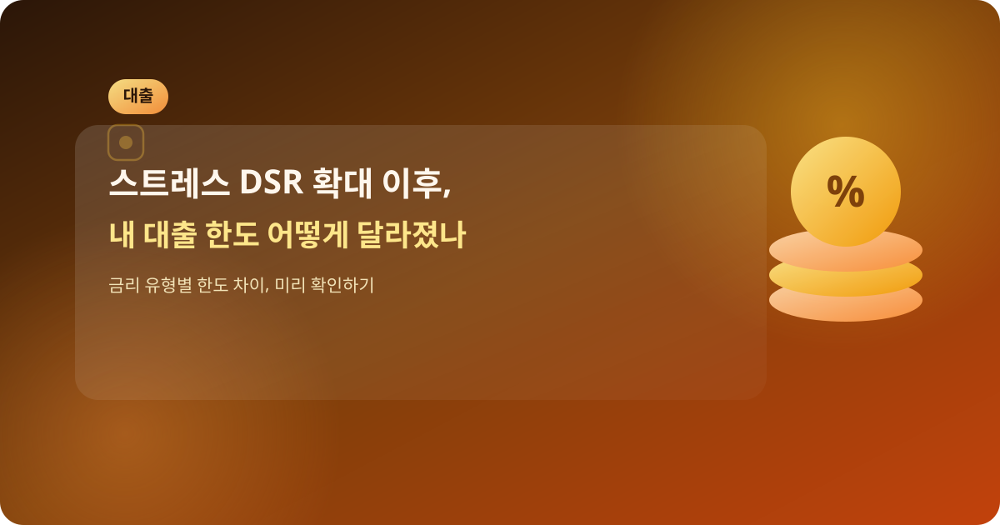
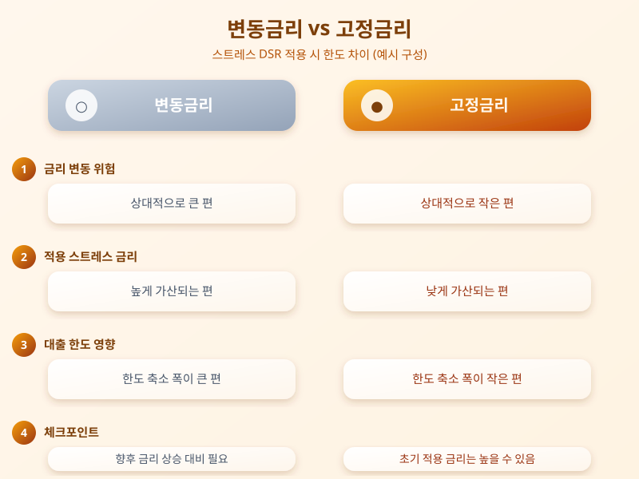

# 스트레스 DSR 확대 이후, 내 대출 한도 어떻게 달라졌나

  

최근 몇 년간 주택담보대출을 준비하는 사람이라면 한 번쯤 '스트레스 DSR'이라는 용어를 들어봤을 것이다. 단계적으로 확대되어 온 이 규제가 이제는 대출 시장에서 익숙한 기준으로 자리 잡았지만, 정작 내 대출 한도가 구체적으로 어떻게 달라지는지 헷갈려 하는 사람이 많다. 오늘은 스트레스 DSR이 무엇이고, 실제 대출 계획을 세울 때 어떤 점을 살펴봐야 하는지 정리해본다.

스트레스 DSR은 향후 금리가 오를 가능성을 미리 반영해, 실제 적용 금리보다 일정 수준 더 높은 금리를 가정해 상환 능력을 계산하는 방식이다. 즉 지금 당장의 금리가 아니라 '만약 금리가 오른다면'을 전제로 대출 한도를 산정하기 때문에, 같은 소득이라도 예전보다 받을 수 있는 대출 금액이 줄어드는 경우가 많다. 이 기준이 단계적으로 확대 적용되면서, 특히 변동금리나 준고정형 대출을 이용하려는 차주일수록 한도 축소를 크게 체감하는 경향이 있다.

  

반면 상대적으로 금리 변동 위험이 적은 고정금리 상품은 스트레스 금리가 낮게 가산되는 구조여서, 같은 조건이라면 변동금리보다 한도 측면에서 유리한 경우가 많다. 따라서 대출을 준비할 때는 단순히 표면 금리만 비교할 것이 아니라, 금리 유형에 따라 실제 한도가 어떻게 달라지는지를 금융회사 창구나 상담을 통해 미리 확인해보는 것이 중요하다. 또한 소득 서류를 어떻게 준비하느냐에 따라서도 인정되는 소득 범위가 달라질 수 있으므로, 관련 서류를 꼼꼼히 챙기는 것도 한도를 늘리는 데 도움이 된다.

결국 스트레스 DSR은 대출자를 옥죄기 위한 규제라기보다는, 향후 금리 변동에 따른 상환 부담을 미리 대비하도록 유도하는 장치에 가깝다. 내 집 마련이나 대환대출을 계획하고 있다면, 한도가 줄었다고 아쉬워하기보다 금리 유형별 한도 차이와 본인의 상환 여력을 꼼꼼히 따져보고 무리하지 않는 선에서 계획을 세우는 것이 현명하다. 필요하다면 여러 금융회사의 조건을 비교해보고, 전문가 상담을 통해 본인에게 맞는 대출 전략을 세워보길 권한다.

※ 이 초안은 AI가 생성했습니다. 게시 전 수치·정책 내용의 사실관계를 반드시 확인하세요.
