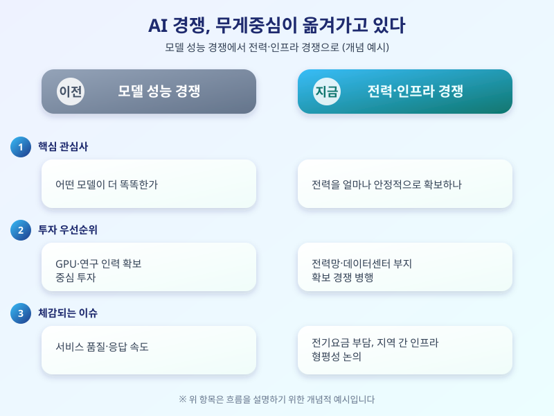

# AI 데이터센터 전력난, 이제는 인프라 경쟁이 됐다

  

최근 AI 서비스가 빠르게 확산되면서 화제의 중심이 조금씩 달라지고 있다. 처음에는 '어떤 모델이 더 똑똑한가'가 관심사였다면, 이제는 '그 모델을 돌릴 전력을 어디서 안정적으로 구하는가'가 더 큰 화두로 떠오르고 있다. AI 데이터센터의 전력 수요가 예상보다 빠르게 늘면서, AI 경쟁의 축이 소프트웨어에서 인프라 쪽으로 옮겨가고 있다는 이야기가 나온다.

대형 언어모델을 학습시키고 서비스하는 데이터센터는 기존 전산센터와 비교할 수 없을 정도로 많은 전력을 소비한다. GPU 서버가 대규모로 밀집해 돌아가다 보니, 데이터센터 한 곳의 전력 사용량이 작은 도시 수준에 이른다는 이야기가 나올 정도다. 이 때문에 데이터센터를 어디에 지을지 결정할 때 가장 먼저 따지는 조건도 '땅값'이 아니라 '전력을 안정적으로 공급받을 수 있는가'로 바뀌는 분위기다.

  

이런 흐름은 기업 단위를 넘어 국가 단위의 경쟁으로 번지고 있다. 주요국들은 데이터센터 유치를 위해 전력망 투자를 서두르고, 반대로 전력 인프라가 부족한 지역은 대형 AI 투자를 유치하는 데 어려움을 겪는 구조가 만들어지는 모양새다. 국내에서도 데이터센터 전력 공급을 둘러싼 지역 간 형평성, 늘어난 전력 수요에 따른 요금 부담을 누가 얼마나 나눠 지느냐 하는 논의가 조금씩 수면 위로 올라오고 있다.

결국 AI 경쟁력을 이야기할 때 이제는 모델 성능만큼이나 전력과 인프라를 함께 살펴봐야 하는 시대가 된 셈이다. 당장 소비자 입장에서 체감하기 어려운 주제일 수 있지만, 전기요금 구조나 지역 개발 계획에까지 영향을 줄 수 있는 만큼 관련 논의가 앞으로 어떻게 흘러가는지 눈여겨볼 필요가 있다.

※ 이 초안은 AI가 생성했습니다. 게시 전 수치·정책 내용의 사실관계를 반드시 확인하세요.
