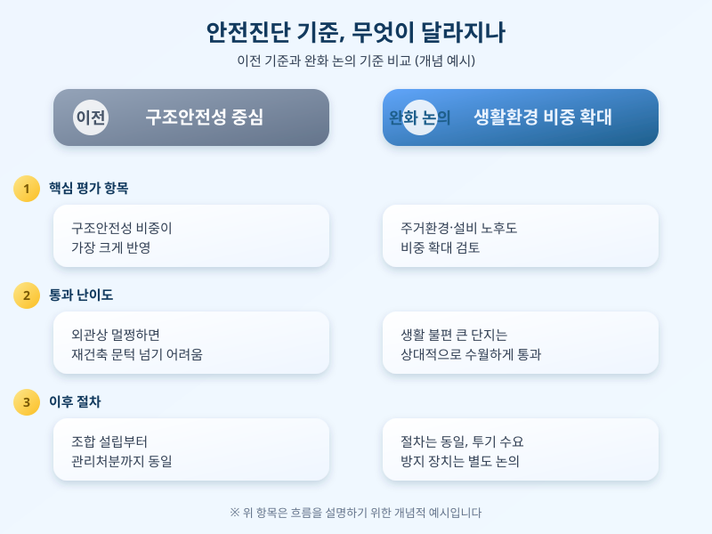

# 재건축 안전진단 규제 완화, 노후 아파트 재건축 속도 빨라질까

  

지어진 지 30년이 넘은 아파트가 갈수록 늘면서, 재건축 사업의 첫 관문인 안전진단 기준을 완화해야 한다는 목소리가 다시 커지고 있다. 최근 몇 년간 정부는 재건축 절차를 간소화하는 방향으로 제도를 손봐왔고, 노후계획도시 특별법 등 관련 논의가 이어지면서 실수요자와 조합원들의 관심도 함께 높아지는 분위기다.

안전진단은 원래 무너질 위험이 있는 건물을 걸러내기 위한 제도로 도입됐지만, 시간이 지나며 재건축 여부를 사실상 좌우하는 관문 역할을 해왔다. 구조안전성 비중이 높았던 과거 기준에서는 외관상 멀쩡해 보이는 아파트가 재건축 문턱을 넘기 어려웠고, 이 때문에 노후 단지 주민들 사이에서는 불만이 꾸준히 쌓여왔다. 최근 논의되는 완화 방향은 구조안전성 비중을 낮추고 주거환경·설비 노후도 비중을 높여, 실제 생활 불편이 큰 단지가 좀 더 수월하게 재건축을 추진할 수 있도록 하는 데 초점이 맞춰져 있다.

  

다만 규제 완화가 곧바로 입주로 이어지는 것은 아니다. 안전진단을 통과하더라도 조합 설립, 사업시행인가, 관리처분인가 등 넘어야 할 단계가 여전히 많고, 단계마다 주민 동의와 행정 절차가 필요하다. 또한 재건축 추진 속도가 빨라지면 특정 지역의 공급·가격에 영향을 줄 수 있어, 투기 수요 유입을 막기 위한 안전장치도 함께 논의되고 있다. 재건축을 준비 중인 단지 주민이라면 완화된 기준이 우리 단지에 실제로 어떻게 적용되는지, 조합 설립 이후 절차는 어떻게 진행되는지 미리 확인해두는 것이 좋다.

노후 아파트가 계속 늘어나는 만큼 재건축 절차를 둘러싼 논의는 앞으로도 계속 이어질 가능성이 크다. 당장 내가 사는 단지와 관련이 없더라도, 안전진단 기준 변화는 도심 주택 공급과 가격 흐름에 영향을 줄 수 있는 만큼 관련 소식을 꾸준히 지켜볼 필요가 있다.

※ 이 초안은 AI가 생성했습니다. 게시 전 수치·정책 내용의 사실관계를 반드시 확인하세요.
