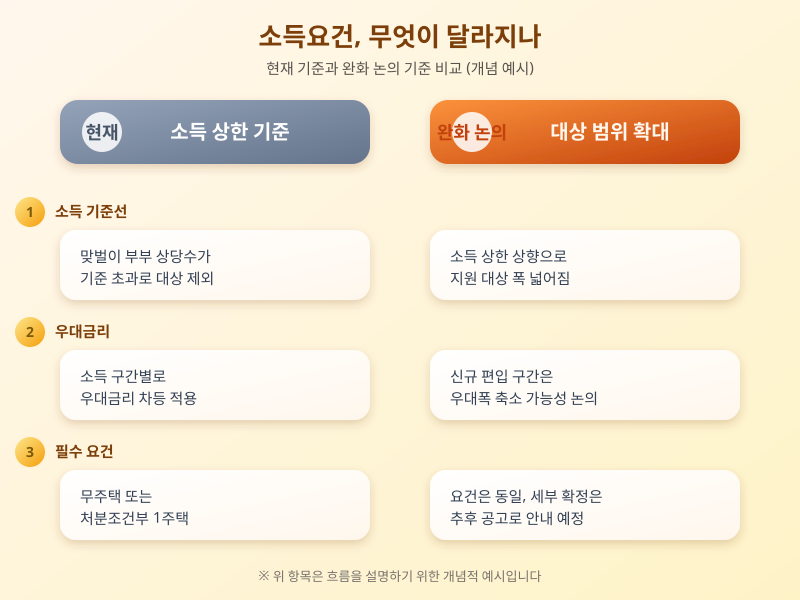

# 신생아특례대출 소득요건 완화 논의, 출산 가구 내 집 마련 문턱 낮아지나

  

신혼부부·출산 가구의 주거 부담을 덜어주기 위해 도입된 신생아특례대출이 다시 주목받고 있다. 저출생 대응이 국가적 과제로 떠오르면서, 현재 정해진 소득요건을 완화해 지원 대상을 넓히자는 논의가 정책 테이블에 오르는 분위기다. "맞벌이라 소득 기준을 넘겨 대상에서 빠졌다"는 아쉬움을 토로해온 가구들 사이에서는, 이번 논의가 실제 제도 개편으로 이어질지 관심이 크다.

신생아특례대출은 출산 가구(무주택 또는 기존 주택 처분을 조건으로 한 1주택 가구)에게 시중 주택담보대출보다 낮은 금리로 주택 구입자금이나 전세자금을 지원하는 정책 상품이다. 도입 취지는 출산으로 늘어난 주거 부담을 정책 금융으로 덜어주자는 데 있지만, 부부 합산 소득에 상한선이 정해져 있어 맞벌이 가구 상당수가 정작 대상에서 제외돼 왔다는 지적이 꾸준히 제기됐다. 최근 논의되는 완화 방향은 이 소득 상한을 높여 지원받을 수 있는 가구 범위를 넓히는 데 초점이 맞춰져 있다.

  

물론 소득요건이 완화된다고 해서 모든 조건이 그대로 유지되는 것은 아니다. 소득 구간이 올라가면 우대금리 폭이 줄거나 대출 한도가 소득 수준별로 차등 적용될 가능성도 함께 논의되고 있어, 세부 기준이 어떻게 확정되느냐에 따라 실제 체감 혜택은 가구마다 다를 수 있다. 일반 주택담보대출과 비교하면 금리와 한도 면에서 여전히 유리한 편이지만, 무주택 요건이나 기존 주택 처분 조건처럼 꼼꼼히 따져야 할 조건들도 함께 딸려 있다.

출산을 앞두고 있거나 이미 자녀를 낳은 가구라면 이번 완화 논의가 실제 시행으로 이어지는지, 그리고 내 소득 수준이 새 기준에 해당하는지를 미리 확인해두는 것이 좋다. 제도 개편은 시행 시기와 세부 조건이 바뀔 수 있는 만큼, 신청을 계획하고 있다면 관련 공고를 꾸준히 살펴보며 최신 정보를 챙기는 자세가 필요하다.

※ 이 초안은 AI가 생성했습니다. 게시 전 수치·정책 내용의 사실관계를 반드시 확인하세요.
