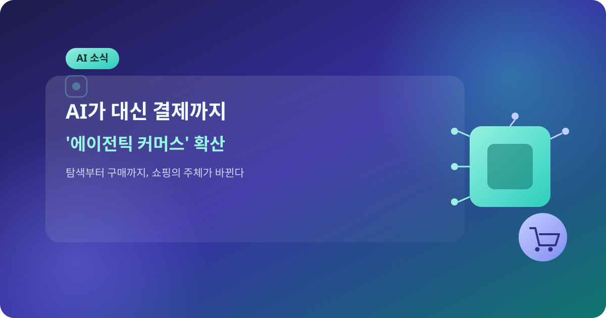
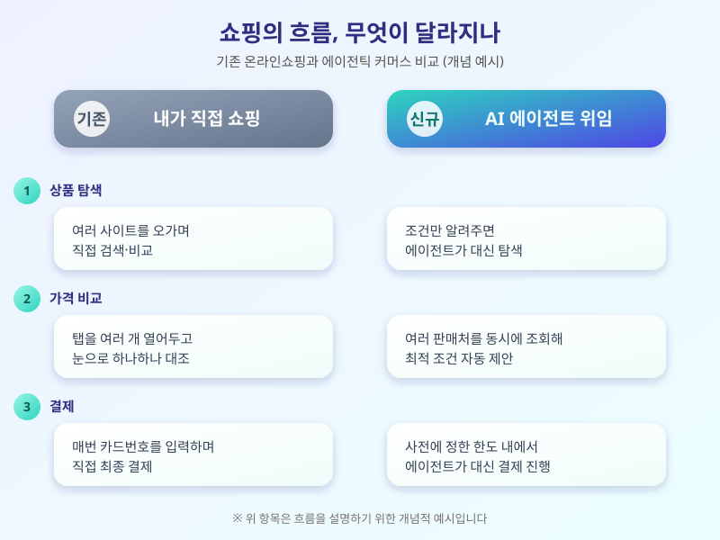

# AI 에이전트가 대신 결제까지, '에이전틱 커머스' 확산 시동

  

요즘 온라인 쇼핑의 풍경이 조금씩 달라지고 있다. 예전에는 원하는 상품을 직접 검색하고, 여러 사이트를 오가며 가격을 비교한 뒤 카드 정보를 입력해 결제까지 사람이 손수 처리했다. 그런데 최근에는 AI 에이전트에게 "이런 조건의 제품을 찾아서 사줘"라고 요청만 하면, 탐색부터 비교, 최종 결제까지 AI가 대신 처리해주는 '에이전틱 커머스(agentic commerce)' 기능이 주요 플랫폼과 결제사들을 중심으로 잇달아 시범 도입되고 있다.

에이전틱 커머스는 단순히 상품을 추천해주던 기존 AI 쇼핑 도우미와는 결이 다르다. 사용자가 원하는 조건(가격대, 배송 기한, 선호 브랜드 등)을 한 번 알려주면, 에이전트가 여러 판매처의 정보를 동시에 조회하고 최적의 옵션을 골라낸 뒤, 미리 설정해둔 결제 수단과 한도 안에서 실제 구매까지 마무리한다. 사람이 일일이 탭을 열고 비교하던 과정이 통째로 자동화되는 셈이다. 국내외 주요 빅테크와 결제 네트워크들도 에이전트가 안전하게 결제를 대행할 수 있도록 하는 표준과 인증 체계를 준비 중인 것으로 알려졌다.

  

다만 아직 넘어야 할 산도 있다. 에이전트가 내 의도와 다른 상품을 잘못 고르거나, 예상보다 많은 금액을 결제해버리는 '오구매' 우려가 대표적이다. 또 결제 권한을 AI에게 넘기는 만큼, 계정 탈취나 권한 오남용이 발생했을 때의 책임 소재와 보안 장치도 함께 마련돼야 한다는 지적이 나온다. 이 때문에 초기 서비스들은 대부분 결제 한도를 낮게 설정하거나, 최종 결제 직전에 사용자 확인을 한 번 더 거치는 방식으로 조심스럽게 도입되는 분위기다.

당장 모든 쇼핑을 AI에게 맡기게 되는 것은 아니지만, 검색과 결제의 경계가 흐려지는 변화의 방향성만큼은 분명해 보인다. 이런 기능을 먼저 써보고 싶다면 결제 한도와 알림 설정을 꼼꼼히 확인하고, 소액 구매부터 천천히 경험해보는 것이 안전할 것이다.

※ 이 초안은 AI가 생성했습니다. 게시 전 수치·정책 내용의 사실관계를 반드시 확인하세요.
