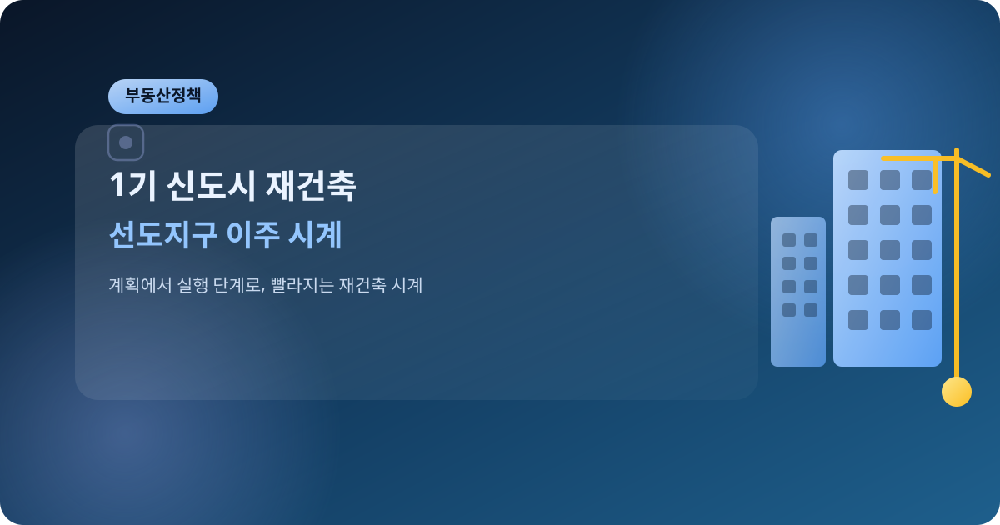
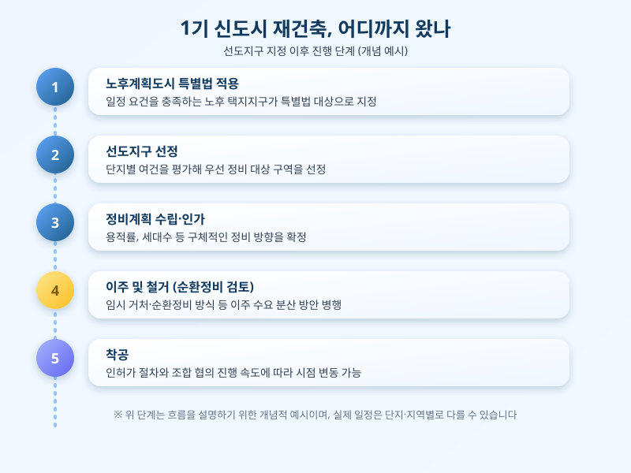

# 1기 신도시 재건축, 선도지구 이주 시계 빨라지나

  

분당, 일산, 평촌, 산본, 중동 등 1기 신도시의 재건축 이야기가 더 이상 먼 미래의 계획이 아니라 실제 일정표로 옮겨가고 있다. 노후계획도시 특별법을 근거로 지정된 선도지구들이 하나둘 정비계획 수립과 이주 준비 단계에 들어서면서, 30년 넘게 그 자리를 지켜온 아파트 단지들의 모습이 조만간 달라질 조짐을 보이고 있다. 재건축은 늘 '언젠가는'이라는 말이 따라붙는 주제였지만, 선도지구라는 이름이 붙은 순간부터는 그 '언젠가'가 훨씬 구체적인 숫자로 바뀌기 시작한다.

1기 신도시 재건축이 다른 재건축 사업과 다른 점은 무엇보다 '동시다발성'에 있다. 특정 한두 단지가 아니라 도시 전체 단위로 정비가 진행되다 보니, 이주 수요와 임시 거처 문제가 한꺼번에 몰릴 수밖에 없는 구조다. 이 때문에 정부와 지자체는 순환정비 방식이나 인근 신규 공급 물량을 연계하는 방안을 함께 검토하고 있는데, 이 조율이 매끄럽게 이뤄지느냐에 따라 실제 이주 시점과 체감 난이도가 크게 달라질 수 있다.

  

해당 단지에 거주하는 주민이라면 지금 시점에서 챙겨야 할 것은 크게 두 가지다. 하나는 자신이 속한 단지의 정비계획 수립 및 이주 일정이 어느 단계까지 와 있는지를 정기적으로 확인하는 것이고, 다른 하나는 이주 시기와 맞물려 전월세 계약 만료 시점을 미리 조정해두는 것이다. 재건축 일정은 각종 인허가 절차와 조합 내부 협의에 따라 예상보다 늦춰지는 경우가 흔하기 때문에, 공지되는 일정을 그대로 믿기보다는 여유를 두고 계획을 세우는 편이 안전하다.

1기 신도시 재건축은 단순히 낡은 아파트를 새로 짓는 문제를 넘어, 수도권 주거 공급과 전월세 시장 전반에 영향을 줄 수 있는 큰 변수다. 선도지구들의 이주가 본격화되는 시점부터는 주변 지역의 전세 수급과 매매가에도 여파가 미칠 가능성이 크므로, 해당 지역 거주자는 물론 인근 지역에서 내 집 마련이나 전월세를 준비 중인 사람들도 관련 소식을 꾸준히 지켜볼 필요가 있다.

※ 이 초안은 AI가 생성했습니다. 게시 전 수치·정책 내용의 사실관계를 반드시 확인하세요.
