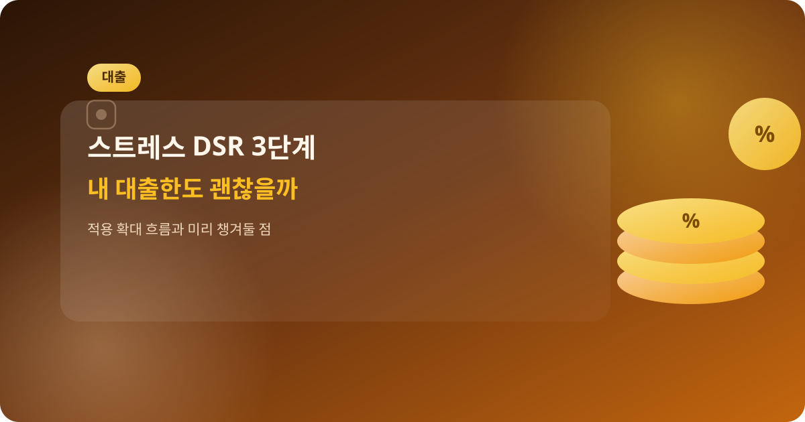
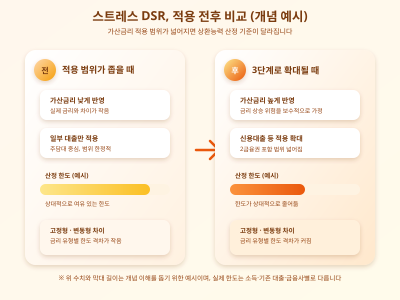

# 스트레스 DSR 3단계 확대, 내 대출한도 어떻게 달라지나

  

요즘 대출 상담을 받아본 사람이라면 '스트레스 DSR'이라는 말을 한 번쯤 들어봤을 것이다. 가계부채 관리 기조가 이어지면서 스트레스 DSR의 적용 범위를 단계적으로 넓히는 방안이 계속 논의되고 있고, 이 변화는 주택담보대출을 준비하는 사람뿐 아니라 신용대출, 2금융권 대출을 이용하는 사람에게도 영향을 줄 수 있다. 막연히 '한도가 줄어든다더라'는 소문으로만 접하기보다, 실제로 어떤 원리로 작동하는지 알아두면 자금 계획을 세우는 데 훨씬 도움이 된다.

스트레스 DSR의 핵심은 실제 적용받는 금리가 아니라, 여기에 일정한 가산금리를 더한 '가상의 금리'로 상환능력을 계산한다는 점이다. 금리가 오를 수 있는 위험까지 미리 반영해서, 빌릴 수 있는 돈의 한도를 보수적으로 산정하는 방식이다. 단계가 올라갈수록 가산되는 금리 수준이 커지고 적용 대상 대출의 범위도 넓어지는 구조이기 때문에, 같은 소득이라도 시기에 따라 받을 수 있는 대출한도가 달라질 수 있다.

  

특히 주목할 부분은 고정형과 변동형 금리 중 어떤 상품을 선택하느냐에 따라 가산금리가 다르게 적용된다는 점이다. 일반적으로 금리 변동 위험이 낮은 고정형 상품은 상대적으로 유리하게, 변동형 상품은 더 보수적으로 한도가 산정되는 경향이 있다. 그래서 대출을 앞두고 있다면 단순히 현재 금리만 비교할 것이 아니라, 본인의 상환 계획과 향후 금리 전망까지 함께 고려해 상품을 고르는 것이 중요해졌다.

대출을 계획 중이라면 지금 시점에서 할 수 있는 준비는 크게 두 가지다. 하나는 실제로 신청하려는 은행이나 2금융권에 본인의 소득·기존 대출 조건으로 받을 수 있는 한도를 미리 문의해보는 것이고, 다른 하나는 적용 범위 확대 일정이나 세부 기준이 변경될 가능성을 열어두고 여유 있게 자금 계획을 짜두는 것이다. 특히 기존 대출을 갈아타거나 추가 대출을 고려하는 경우라면, 변경된 기준이 적용되기 전과 후의 한도 차이를 금융사 상담을 통해 직접 확인해보는 편이 안전하다.

결국 스트레스 DSR 확대는 '대출을 더 어렵게 만드는 규제'로만 볼 것이 아니라, 금리 상승기에 과도한 빚을 지지 않도록 안전장치를 두는 제도로 이해할 필요가 있다. 다만 그 과정에서 당장 자금이 필요한 실수요자의 체감 부담이 커질 수 있는 만큼, 본인의 대출 계획이 있다면 관련 뉴스와 금융사 공지를 꾸준히 살펴보고 미리 대비해두는 것이 좋다.

※ 이 초안은 AI가 생성했습니다. 게시 전 수치·정책 내용의 사실관계를 반드시 확인하세요.
