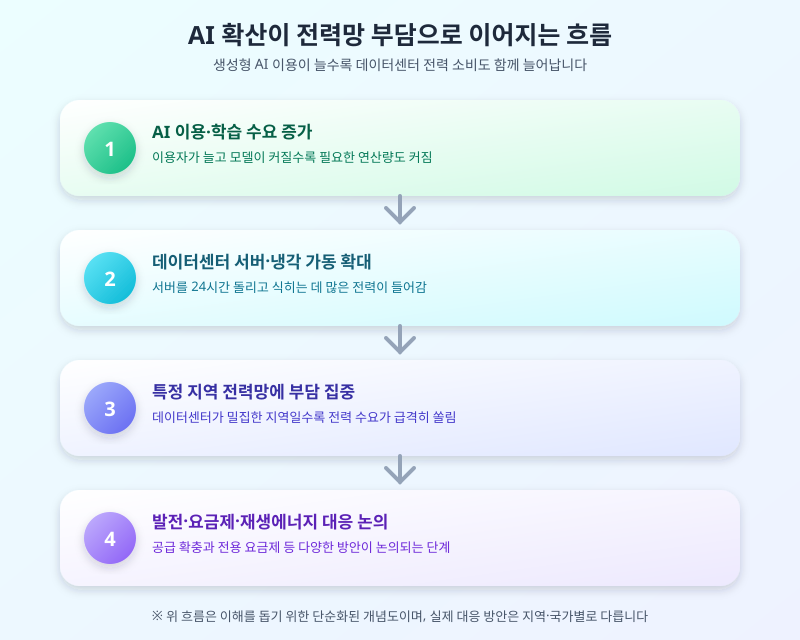

# AI가 먹어치우는 전기, 데이터센터 전력망은 괜찮을까

  

최근 몇 년간 생성형 AI가 빠르게 확산되면서 자주 등장하는 뉴스 중 하나가 데이터센터의 전력 소비 문제다. AI 모델을 학습시키고 서비스를 운영하는 데는 엄청난 양의 컴퓨팅 자원이 필요하고, 이 자원을 24시간 돌리는 데이터센터는 그만큼 많은 전기를 쓴다. 단순히 IT 업계만의 이야기가 아니라 전력망 전체의 안정성과 직결되는 문제이다 보니, 각국 정부와 전력회사들이 대응 방안을 논의하는 모습이 점점 자주 눈에 띈다.

AI 서비스 하나를 운영하려면 거대한 연산을 처리하는 서버와 이를 식히는 냉각 시스템이 함께 돌아가야 한다. 이용자가 늘고 모델이 복잡해질수록 필요한 서버 수와 전력량도 함께 늘어나는 구조다. 문제는 이런 데이터센터가 특정 지역에 집중적으로 들어서는 경우가 많아서, 그 지역의 전력망에 갑작스러운 부담이 몰릴 수 있다는 점이다.

  

이 때문에 전력회사와 지자체, 데이터센터 운영사 사이에서는 전력 공급 계획을 어떻게 짜야 할지를 둘러싼 논의가 활발하다. 신규 발전 용량을 늘리는 방안부터, 데이터센터 전용 전력 요금제를 새로 만드는 방안, 재생에너지나 자체 발전 설비를 활용하도록 유도하는 방안까지 다양한 아이디어가 오가고 있다. 아직 구체적인 제도로 확정된 내용보다는 논의 단계에 있는 사안이 많은 만큼, 앞으로 발표될 세부 방침을 지켜볼 필요가 있다.

이러한 흐름은 단순히 전력 산업계만의 이슈가 아니다. AI 관련 산업에 관심이 있는 투자자라면 전력 인프라 기업이나 관련 설비 업체의 동향을, 지역 주민이라면 인근에 데이터센터가 들어설 경우 전기요금이나 전력 공급 안정성에 변화가 있을지를 눈여겨볼 만하다. AI 기술의 발전 속도가 빠른 만큼, 이를 뒷받침하는 전력 인프라 논의도 함께 주목해야 할 시점이다.

※ 이 초안은 AI가 생성했습니다. 게시 전 수치·정책 내용의 사실관계를 반드시 확인하세요.
