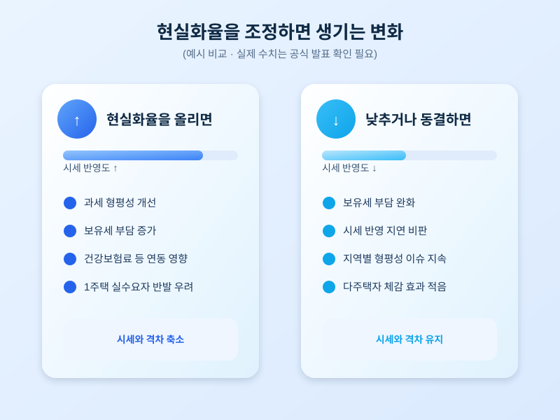

# 공시가격 로드맵, 다시 손보나 — 내 보유세는 어떻게 될까

  

매년 가을이 되면 국토교통부가 다음 해에 적용할 공시가격 현실화 계획을 다시 손보는지가 화두에 오른다. 공시가격은 재산세와 종합부동산세 같은 보유세뿐 아니라 건강보험료, 기초연금, 각종 복지 수급 기준에도 영향을 주는 핵심 지표라서, 로드맵이 어떤 방향으로 조정되느냐에 따라 전국 수많은 주택 보유자의 세 부담이 달라질 수 있다. 최근에도 현실화율을 더 올릴지, 동결할지, 혹은 단계적으로 낮출지를 둘러싼 논의가 다시 떠오르고 있어 집을 가진 사람이라면 눈여겨볼 시점이다.

공시가격 현실화율이란 실제 시세 대비 공시가격이 차지하는 비율을 뜻한다. 이 비율을 높이면 시세와 공시가격의 차이가 줄어 과세 형평성이 높아지지만, 동시에 보유세 부담도 함께 커진다는 점에서 논쟁이 끊이지 않는다. 반대로 현실화율을 낮추거나 동결하면 세 부담은 완화되지만, 시세 변동을 제때 반영하지 못한다는 비판을 받기 쉽다. 정부는 이런 양쪽 요구 사이에서 로드맵의 조정 폭과 시행 시점을 저울질하고 있는 것으로 보인다.

  

특히 올해는 집값이 지역별로 엇갈린 흐름을 보이고 있어 셈법이 더 복잡하다. 수도권 일부 지역은 거래가 다시 늘며 시세가 오른 반면, 지방 중소도시는 여전히 거래 침체가 이어지는 곳이 많다. 이런 상황에서 전국에 단일한 기준으로 현실화율을 조정하면 지역별로 체감하는 세 부담 차이가 커질 수 있다는 지적도 나온다. 1주택 실수요자에 대한 세 부담 완화 장치를 함께 손볼지도 관심사다.

아직 구체적인 조정 수치나 시행 시점이 확정된 단계는 아니지만, 연말로 갈수록 관련 발표가 이어질 가능성이 높다. 1주택자든 다주택자든 보유세 변화는 매년 챙겨야 하는 생활비 항목이 된 만큼, 공식 발표가 나오면 자신의 주택 공시가격 전망치와 예상 세액을 미리 가늠해보는 습관이 필요하다. 로드맵 조정 여부와 세부 기준은 추후 국토교통부의 공식 발표를 통해 확인하는 것이 가장 정확하다.

※ 이 초안은 AI가 생성했습니다. 게시 전 수치·정책 내용의 사실관계를 반드시 확인하세요.
