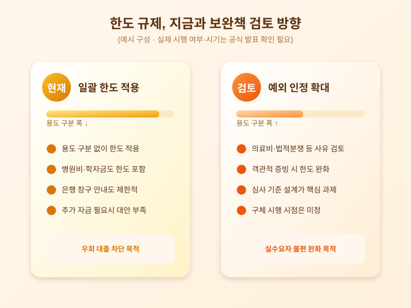

# 생활안정자금 대출, 한도 규제 보완책 나올까 — 실수요자가 챙길 점

  

주택을 담보로 생활비나 긴급한 자금 수요를 충당하려는 사람들에게 최근 가장 민감한 이슈 중 하나는 생활안정자금 목적 주택담보대출에 한도를 두는 규제다. 집값 상승기에 대출을 생활자금 명목으로 받아 주택 구입이나 투자에 우회적으로 활용하는 사례를 막기 위해 도입된 조치인데, 시행 이후 실제로 병원비나 자녀 학자금처럼 꼭 필요한 곳에 돈을 써야 하는 사람들까지 함께 영향을 받는다는 목소리가 커지면서 보완책 논의가 이어지고 있다.

한도 규제의 취지는 분명하다. 주택담보대출을 받아 그 돈을 다른 주택 구입 자금으로 돌리는 이른바 '우회 대출'을 차단해 가계대출 총량과 집값을 함께 관리하겠다는 것이다. 문제는 이 규제가 용도를 세밀하게 구분하지 않고 일괄 적용되다 보니, 수술비나 전세금 반환, 자녀 결혼자금처럼 생활자금 성격이 뚜렷한 경우에도 한도에 걸려 필요한 만큼 돈을 빌리지 못하는 사례가 생긴다는 점이다. 은행 창구에서도 서류를 꼼꼼히 갖춰 와도 한도 자체가 막혀 있어 안내하기 곤란하다는 반응이 나온다.

  

이런 불만이 쌓이자 금융당국과 금융권에서는 예외 인정 범위를 넓히는 방향의 보완책을 검토하고 있는 것으로 알려졌다. 의료비나 법적 분쟁에 따른 자금 수요처럼 객관적으로 확인 가능한 경우에 대해서는 별도 심사를 거쳐 한도를 완화해주는 방식이 유력하게 거론된다. 다만 예외를 지나치게 넓히면 애초 규제의 취지가 흐려질 수 있어, 당국은 심사 기준을 어떻게 설계할지를 놓고 고심하는 모습이다.

생활안정자금 대출을 계획 중이라면 지금 단계에서는 자신의 자금 용도가 예외 인정 대상에 해당할 가능성이 있는지, 필요한 입증 서류는 무엇인지를 미리 은행과 상담해 두는 것이 도움이 된다. 보완책의 구체적인 내용과 시행 시점은 아직 확정되지 않았으므로, 실제 대출을 받기 전에는 최신 공지와 금융당국의 공식 발표를 다시 한번 확인하는 것이 안전하다.

※ 이 초안은 AI가 생성했습니다. 게시 전 수치·정책 내용의 사실관계를 반드시 확인하세요.
