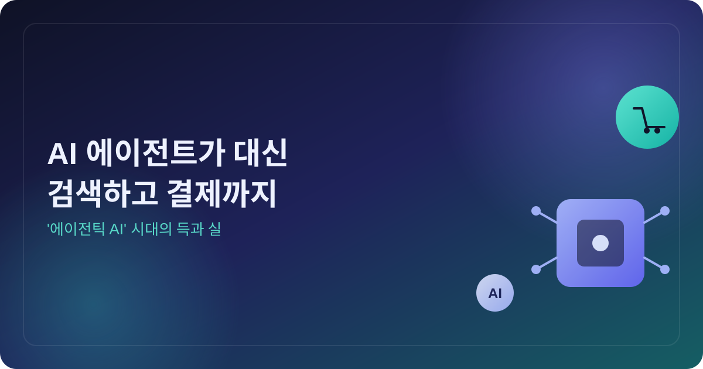
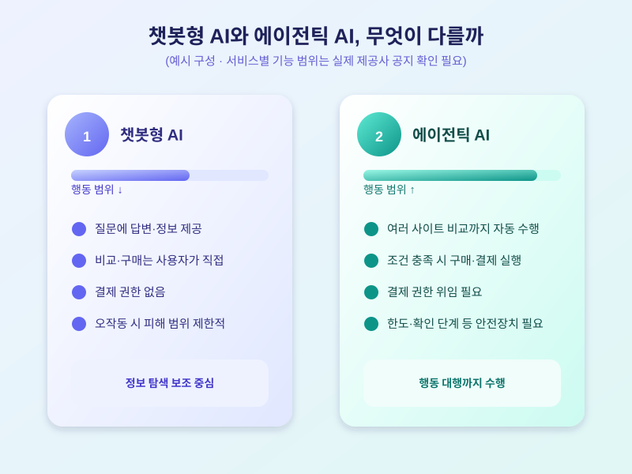

# AI 에이전트가 대신 검색하고 결제까지, '에이전틱 AI' 시대의 득과 실

  

최근 들어 "챗봇에게 물어본다"는 말이 점점 낡은 표현이 되어가고 있다. 질문에 답만 해주던 AI를 넘어, 사람을 대신해 웹을 돌아다니며 상품을 비교하고 장바구니에 담고 결제까지 처리하는 '에이전틱 AI' 서비스가 주요 기술기업들을 중심으로 속속 등장하고 있기 때문이다. 말 한마디로 번거로운 검색과 비교 과정을 통째로 맡길 수 있다는 점에서, 일상 소비 방식을 바꿀 다음 변화로 주목받고 있다.

기존 챗봇형 AI와 에이전틱 AI의 가장 큰 차이는 '행동'의 범위다. 챗봇은 정보를 정리해 보여주는 데 그쳤지만, 에이전틱 AI는 여러 쇼핑몰을 오가며 가격과 옵션을 직접 비교하고, 사용자가 미리 정해둔 조건에 맞으면 결제 수단까지 연동해 구매를 완료한다. 여행 일정 예약, 정기구독 관리, 생활용품 자동 주문처럼 반복적이고 비교가 필요한 작업일수록 효용이 크다는 평가가 나온다.

  

다만 결제 권한까지 AI에 맡긴다는 점은 새로운 우려도 함께 불러온다. AI가 가격이나 조건을 잘못 해석해 의도하지 않은 상품을 구매하거나, 결제 정보가 연동된 계정이 해킹될 경우 피해 범위가 커질 수 있다는 지적이 대표적이다. 이 때문에 서비스 제공사들은 구매 한도 설정, 최종 확인 단계 추가, 결제 전 알림 발송 등 안전장치를 함께 도입하는 추세다. 아직 국내에서는 결제 대행 범위나 책임 소재에 관한 명확한 기준이 자리 잡지 않은 만큼, 이용자 스스로도 자동결제 한도를 낮게 설정하고 거래 내역을 주기적으로 확인하는 습관이 필요하다.

에이전틱 AI는 분명 편리하지만, 아직은 과도기의 기술이기도 하다. 새로운 서비스를 시도해보고 싶다면 소액 결제나 한도가 명확한 서비스부터 경험해보면서, 어디까지 AI에 맡기고 어디서부터는 직접 확인할지 자신만의 기준을 세워두는 것이 현명한 접근이 될 것이다.

※ 이 초안은 AI가 생성했습니다. 게시 전 수치·정책 내용의 사실관계를 반드시 확인하세요.
