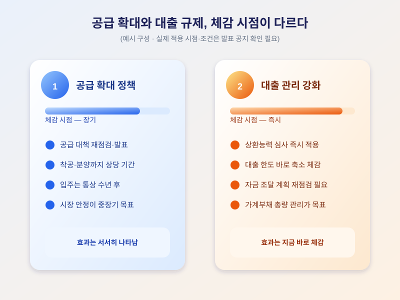

# "공급은 늘리고 대출은 조인다" — 엇박자 속 내 집 마련 전략은

  

최근 정부는 수도권 주택 공급을 늘리겠다는 신호를 보내면서도, 가계대출은 오히려 더 엄격하게 관리하고 있습니다. 내 집 마련을 준비하는 입장에서는 이 엇박자를 어떻게 받아들여야 할지 궁금해집니다.

정부는 주택 공급 대책을 전면 재점검하겠다는 방침을 밝혔고 수도권 신규 공급안이 곧 발표될 수 있다는 보도가 이어지고 있습니다. 다만 공급 확대는 중장기 효과가 크고 실제 입주까지 수년이 걸리는 만큼, 발표 시점과 입주 시점 사이에는 긴 간격이 있을 수 있습니다.

  

반면 대출 쪽은 가계부채 총량 관리와 상환능력 심사를 강화하는 기조가 전 금융권에 자리 잡으면서, 실제 대출 한도는 예전보다 줄어든 경우가 많습니다. 결국 '살 수 있는 집'은 늘어나는데 '빌릴 수 있는 돈'은 줄어드는 셈이라, 같은 목표를 향한 두 정책이 다르게 체감됩니다.

실수요자라면 세 가지를 점검해볼 만합니다. 첫째, 공급 발표의 입주 시점과 자신의 매수 희망 시점을 분리해 생각하는 것. 둘째, 지금 기준으로 받을 수 있는 대출 한도를 미리 가늠해보는 것. 셋째, 생애최초 등 특례 제도의 조건 변화를 챙겨보는 것입니다. 헤드라인에 일희일비하기보다 각 정책이 미치는 시점과 방식을 구분해 자금 계획을 점검하는 일이 중요합니다.

※ 이 초안은 AI가 생성했습니다. 게시 전 수치·정책 내용의 사실관계를 반드시 확인하세요.
