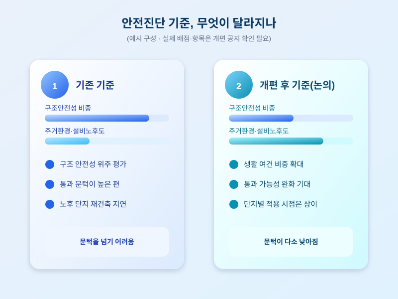

# 재건축 안전진단 완화, 우리 아파트도 속도 낼까

  

최근 정부가 재건축 추진의 첫 관문인 안전진단 기준을 다시 손보겠다는 신호를 보내면서, 오래된 아파트 단지들의 기대감이 커지고 있습니다. 재건축은 집값뿐 아니라 거주 환경과 직결되는 문제라, 기준이 어떻게 바뀌는지에 따라 단지별 희비가 갈릴 수 있습니다.

그동안 안전진단은 구조안전성 비중이 높아 통과가 까다로운 '재건축의 가장 큰 문턱'으로 꼽혀왔습니다. 이 비중을 낮추고 주거환경·설비노후도 비중을 높이는 쪽으로 기준이 조정된다면, 문턱에 막혀 있던 노후 단지들도 재건축 절차에 다시 들어설 수 있게 됩니다.

  

다만 완화가 모든 단지에 똑같이 적용되는 것은 아닙니다. 지은 지 오래됐다고 저절로 통과되는 것이 아니라 단지별로 실제 신청과 심사 절차를 거쳐야 하고, 지자체별 세부 지침이나 시행 시점도 다를 수 있습니다. 통과 후에도 조합 설립, 사업시행인가 등 이후 절차가 남아 있어 바로 착공으로 이어지지는 않습니다.

내가 사는, 혹은 관심 있는 단지가 재건축 연한에 해당한다면 기준 개편 내용과 시행 일정을 먼저 확인해보는 것이 좋습니다. 완화는 '가능성을 높이는 신호'이지 '즉시 확정'을 뜻하지는 않는다는 점을 유념하며, 조급하게 움직이기보다 단계별 절차를 차분히 지켜보는 자세가 필요합니다.

※ 이 초안은 AI가 생성했습니다. 게시 전 수치·정책 내용의 사실관계를 반드시 확인하세요.
