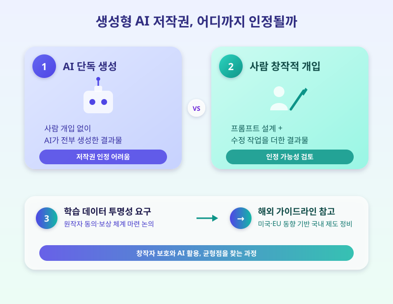

# 생성형 AI 저작권 가이드라인, 창작자와 이용자 모두를 위한 기준 나올까

  

최근 생성형 AI로 만든 글, 그림, 음악이 일상 곳곳에 퍼지면서 '이 창작물의 저작권은 누구에게 있는가'라는 질문이 점점 더 현실적인 문제로 다가오고 있습니다. AI가 학습한 데이터의 저작권 문제부터 AI가 만들어낸 결과물의 권리 인정 여부까지, 창작자와 이용자 모두가 궁금해할 만한 쟁점들이 쌓여가고 있습니다.

가장 뜨거운 쟁점은 AI 학습 데이터입니다. AI 모델은 방대한 양의 글과 이미지를 학습해 결과물을 만들어내는데, 그 학습 데이터 중에는 원작자의 동의 없이 사용된 콘텐츠도 섞여 있을 수 있습니다. 이 때문에 창작자 단체들은 학습 데이터 사용에 대한 투명한 공개와 보상 체계를 요구하고 있고, 반대로 AI 기술 발전을 위해 데이터 활용의 자유도를 지켜야 한다는 목소리도 있습니다.

  

또 하나의 쟁점은 AI가 만든 결과물 자체의 저작권 인정 여부입니다. 사람의 창작적 기여가 거의 없이 AI가 전부 생성한 결과물에는 저작권을 인정하기 어렵다는 입장이 우세하지만, 사람이 프롬프트를 세밀하게 설계하고 수정 작업을 더한 경우라면 어디까지를 '창작'으로 볼 것인지 기준이 모호합니다. 해외에서는 미국과 유럽연합을 중심으로 AI 저작물의 권리 범위와 학습 데이터 활용 기준을 구체화하는 가이드라인 논의가 이어지고 있고, 국내에서도 이를 참고한 제도 정비 논의가 점차 속도를 내고 있습니다.

제도가 완전히 자리 잡기 전까지는 AI를 활용해 콘텐츠를 만드는 사람도, 그 결과물을 활용하는 기업도 각자 주의가 필요합니다. AI로 제작한 콘텐츠를 상업적으로 활용하려 한다면 해당 AI 서비스의 이용약관에서 저작권 관련 조항을 꼼꼼히 확인하고, 타인의 창작물을 학습 데이터나 참고자료로 활용할 때도 저작권 침해 가능성을 염두에 두는 습관이 필요한 시점입니다.

※ 이 초안은 AI가 생성했습니다. 게시 전 수치·정책 내용의 사실관계를 반드시 확인하세요.
