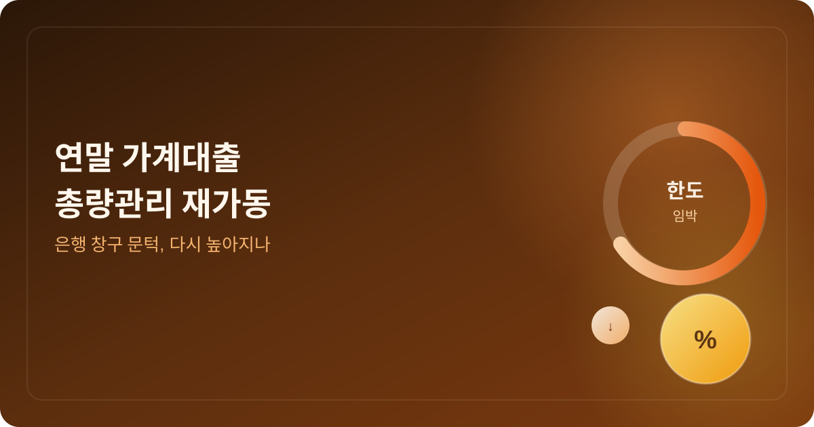
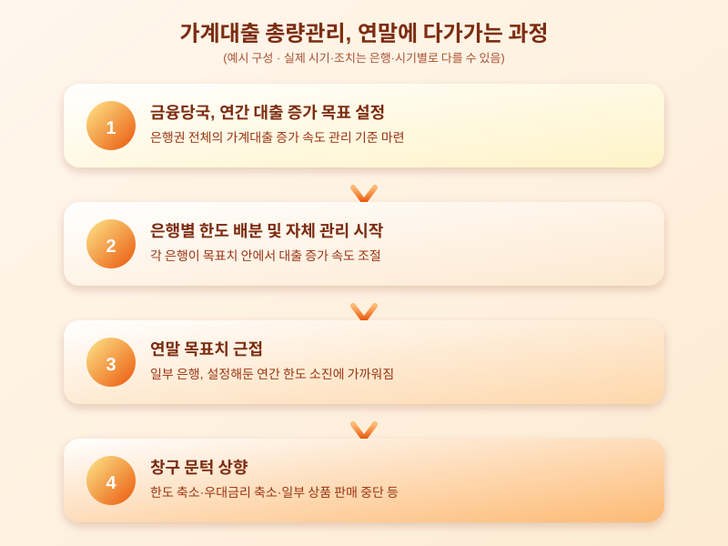

# 연말 가계대출 총량관리 재가동, 은행 창구 문턱 다시 높아지나

  

연말이 가까워지면 어김없이 등장하는 뉴스가 하나 있습니다. 바로 "가계대출 총량관리가 다시 강화된다"는 소식인데요. 매년 비슷한 시기에 반복되는 패턴이라 익숙하게 느껴질 수도 있지만, 마침 대출을 계획하고 있는 입장이라면 그 시점과 영향을 미리 알아두는 것이 자금 계획에 큰 도움이 됩니다.

가계대출 총량관리는 금융당국이 은행권 전체의 가계대출 증가 속도를 일정 범위 안에서 관리하도록 유도하는 방식입니다. 연초에 은행별로 한 해 동안 늘릴 수 있는 대출 증가 목표치를 정해두고, 그 목표치에 다가갈수록 은행들은 스스로 대출 문턱을 높이기 시작합니다. 상반기에는 비교적 여유 있게 대출을 내주던 은행들도 연말이 가까워지면 신규 대출 접수를 일시 중단하거나 우대금리 혜택을 줄이는 식으로 속도를 조절하는 경우가 많습니다.

  

올해도 연말을 앞두고 비슷한 흐름이 감지되고 있습니다. 은행마다 목표 대비 실제 증가 속도가 다르기 때문에, 어떤 곳은 이미 한도를 조이기 시작했고 어떤 곳은 아직 여유가 있는 등 체감 정도가 제각각일 수 있습니다. 특히 주택담보대출이나 전세자금대출처럼 금액이 큰 대출일수록 은행별 정책 변화에 더 민감하게 반응하는 경향이 있어, 신청 시점에 따라 받을 수 있는 한도나 금리 조건이 달라질 가능성이 있습니다.

이런 시기에 대출을 계획하고 있다면 몇 가지 점을 챙겨두는 것이 좋습니다. 먼저 한 은행의 조건만 보지 말고 여러 금융기관의 한도와 금리를 함께 비교해보는 습관이 필요합니다. 또한 연말로 갈수록 조건이 더 까다로워질 가능성이 있는 만큼, 필요한 자금 규모와 시기가 정해져 있다면 상담을 서둘러 받아보는 것도 방법입니다. 1금융권 문턱이 높아졌다고 성급하게 2금융권으로 눈을 돌리기보다는, 금리와 상환 부담을 꼼꼼히 따져본 뒤 결정하는 신중함도 필요합니다.

가계대출 총량관리는 매년 반복되는 익숙한 패턴이지만, 그 타이밍을 놓치면 당장 필요한 자금을 계획대로 마련하지 못할 수도 있습니다. 대출을 앞두고 있다면 지금부터 은행별 공지와 창구 분위기를 꾸준히 살펴보시길 권합니다.

※ 이 초안은 AI가 생성했습니다. 게시 전 수치·정책 내용의 사실관계를 반드시 확인하세요.
